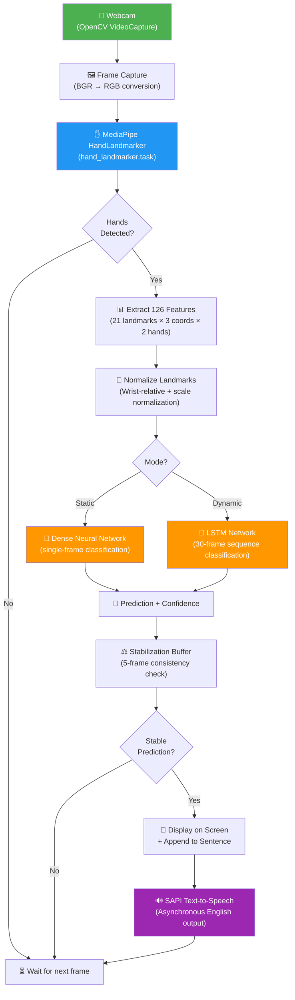
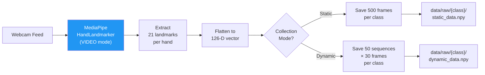
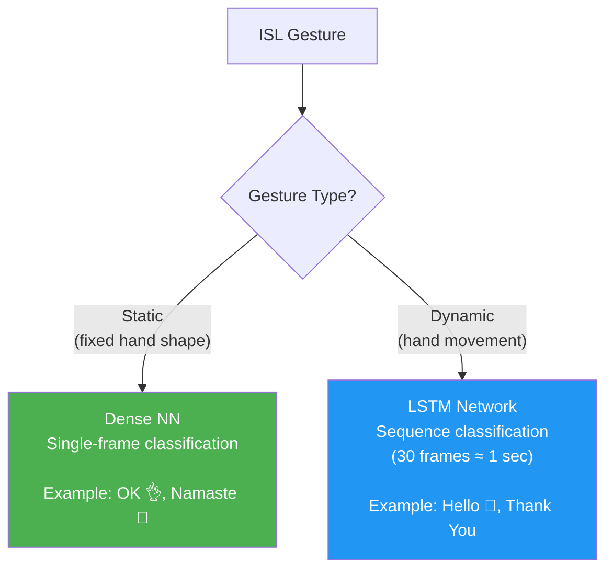
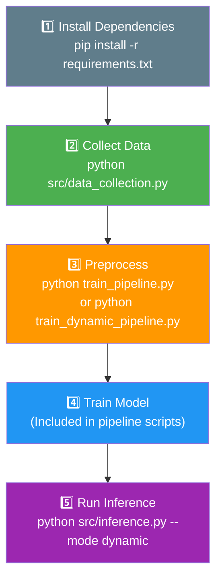

# Indian Sign Language Detection & Translation System

## Project Documentation — Architecture & Design

---

## 1. Abstract

This project presents a real-time **Indian Sign Language (ISL) detection and translation system** that recognizes hand gestures via a webcam and translates them into text and synthesized speech. The system employs **MediaPipe HandLandmarker** for 3D hand landmark extraction and dual neural network architectures — a **Dense Neural Network** for static (single-frame) gesture recognition and a **Long Short-Term Memory (LSTM)** network for dynamic (sequence-based) gesture recognition. Detected signs are spoken aloud in English using the **Windows SAPI** text-to-speech engine. The system is designed for local execution on Windows and achieves **99.75%** accuracy on static gestures and **100%** on dynamic gestures across the initial vocabulary of 5 words.

---

## 2. Problem Statement

Indian Sign Language (ISL) is used by approximately **1.8 million deaf individuals in India** (Census 2011). Unlike American Sign Language (ASL), ISL is a **two-handed** sign language with distinct grammar and vocabulary, yet very few technological tools exist for its recognition. This project aims to bridge the communication gap by building an accessible, real-time ISL translator that can detect hand gestures and convert them to spoken English.

---

## 3. System Architecture Overview



---

## 4. Data Pipeline

### 4.1 Data Collection



**MediaPipe HandLandmarker** detects 21 3D landmarks per hand:

```
Landmark Map (per hand):
  0: WRIST
  1-4: THUMB (CMC → TIP)
  5-8: INDEX FINGER (MCP → TIP)
  9-12: MIDDLE FINGER (MCP → TIP)
  13-16: RING FINGER (MCP → TIP)
  17-20: PINKY (MCP → TIP)
```

**Feature Vector**: Each frame produces a **126-dimensional** vector:
- Left hand: 21 landmarks × 3 coordinates (x, y, z) = **63 features**
- Right hand: 21 landmarks × 3 coordinates (x, y, z) = **63 features**
- Total: **126 features per frame**

If only one hand is detected, the other hand's 63 features are filled with zeros.

### 4.2 Preprocessing

| Step | Description |
|---|---|
| **Normalization** | Subtract wrist position (landmark 0) from all landmarks → position-invariant. Scale by max distance from wrist → size-invariant. |
| **Augmentation** (static only) | 3× augmentation: Gaussian noise (σ=0.01), random scaling (0.9–1.1), random translation (σ=0.02) |
| **Label Encoding** | sklearn LabelEncoder maps class names to integer indices |
| **Train/Test Split** | 80/20 stratified split (random_state=42) |

**Normalization Formula** (per hand):

$$\hat{L}_i = \frac{L_i - L_0}{\max_{j} \| L_j - L_0 \|}$$

Where $L_i$ is the $i$-th landmark position and $L_0$ is the wrist.

### 4.3 Current Dataset

| Class | Data Type | Sequences | Frames per Sequence | Total Usable Frames |
|---|---|---|---|---|
| Hello | Dynamic | 50 | 30 | ~1,500 |
| Namaste | Dynamic | 50 | 30 | ~1,500 |
| Bye | Dynamic | 50 | 30 | ~1,500 |
| Thank You | Dynamic | 50 | 30 | ~1,500 |
| Sorry | Dynamic | 50 | 30 | ~1,500 |

---

## 5. Model Architectures

### 5.1 Static Model — Dense Neural Network

For recognizing gestures that can be identified from a **single frame** (hand pose).

```
Input (126) → Dense(256, ReLU) → BatchNorm → Dropout(0.3)
           → Dense(128, ReLU) → BatchNorm → Dropout(0.3)
           → Dense(64, ReLU)  → BatchNorm
           → Dense(N, Softmax)
```

| Property | Value |
|---|---|
| **Input Shape** | (126,) — normalized landmark features |
| **Output** | N classes (softmax probability distribution) |
| **Parameters** | ~75,781 (296 KB) |
| **Optimizer** | Adam (lr=0.001) |
| **Loss Function** | Categorical Cross-Entropy |
| **Callbacks** | EarlyStopping (patience=10), ModelCheckpoint, ReduceLROnPlateau |
| **Test Accuracy** | **99.75%** (5 classes) |

### 5.2 Dynamic Model — LSTM Network

For recognizing gestures that involve **motion over time** (30-frame sequences).

```
Input (30, 126) → LSTM(128, return_sequences=True) → Dropout(0.3)
               → LSTM(64, return_sequences=False)  → Dropout(0.3)
               → Dense(64, ReLU) → BatchNorm
               → Dense(32, ReLU)
               → Dense(N, Softmax)
```

| Property | Value |
|---|---|
| **Input Shape** | (30, 126) — 30 frames × 126 features |
| **Output** | N classes (softmax probability distribution) |
| **Optimizer** | Adam (lr=0.001) |
| **Loss Function** | Categorical Cross-Entropy |
| **Callbacks** | EarlyStopping (patience=15), ModelCheckpoint, ReduceLROnPlateau |
| **Batch Size** | 16 |
| **Test Accuracy** | **100.00%** (5 classes) |

### 5.3 Why Two Models?



- **Static signs** (e.g., Namaste — palms together) can be recognized from a single frame since the hand shape alone is distinctive.
- **Dynamic signs** (e.g., Hello — waving motion, Thank You — chin to forward) require temporal information across multiple frames to distinguish the direction and pattern of movement.

---

## 6. Inference Pipeline

### 6.1 Prediction Stabilization

To prevent flickering between predictions, a **rolling buffer** of 5 frames is used:

```
Frame Buffer (size=5): [Hello, Hello, Hello, Hello, Hello]
                       → All same & confidence > 0.6 → ✅ CONFIRM "Hello"

Frame Buffer (size=5): [Hello, Bye, Hello, Namaste, Hello]
                       → Not consistent → ❌ No prediction output
```

### 6.2 Cooldown Mechanism

After speaking a word, there is a **1-second cooldown** before the same word can be spoken again. This prevents rapid-fire repetition of the same detection.

### 6.3 Sentence Builder

Detected words are accumulated into a sentence. The user can:
- Press **Space** to speak the full sentence
- Press **C** to clear the sentence
- Press **M** to toggle between static/dynamic mode
- Press **Q** to quit

### 6.4 UI Overlay

The webcam feed includes a semi-transparent overlay displaying:
- Current prediction with confidence bar
- Active mode (STATIC/DYNAMIC)
- FPS counter
- Accumulated sentence
- Keyboard controls

---

## 7. Text-to-Speech (TTS)

| Property | Value |
|---|---|
| **Engine** | Windows SAPI 5 (SpVoice) via `win32com` |
| **Language** | English (system default) |
| **Mode** | Asynchronous (non-blocking) — `SVSFlagsAsync` |
| **Concurrency** | Uses COM `pythoncom.CoInitialize()` for thread safety |
| **Rate** | Configurable (default: 150 WPM mapped to SAPI rate 0) |
| **Volume** | Configurable (default: 100%) |

> [!NOTE]
> The system bypasses `pyttsx3` and uses native Windows COM SAPI directly. This resolves threading/freezing issues that occur when `pyttsx3` creates multiple engine instances across threads.

---

## 8. Technology Stack

| Component | Technology | Version | Purpose |
|---|---|---|---|
| **Hand Detection** | MediaPipe Tasks API | 0.10.35 | 21 landmark extraction per hand |
| **ML Framework** | TensorFlow / Keras | 2.21.0 | Neural network training & inference |
| **Computer Vision** | OpenCV | 5.0.0 | Webcam capture, frame processing, UI rendering |
| **Data Processing** | NumPy | 2.5.1 | Array operations, landmark storage |
| **ML Utilities** | scikit-learn | 1.9.0 | Label encoding, train/test split, evaluation |
| **Visualization** | Matplotlib + Seaborn | 3.11 / 0.13 | Training curves, confusion matrices |
| **Text-to-Speech** | Windows SAPI 5 | - | English speech synthesis |
| **Language** | Python | 3.12 | Core runtime |
| **OS** | Windows | - | Local deployment target |

---

## 9. Project Directory Structure

```
MajorProject/
├── data/
│   ├── raw/                          # Raw landmark data per class
│   │   ├── Hello/
│   │   │   └── dynamic_data.npy      # Shape: (50, 30, 126)
│   │   ├── Namaste/
│   │   ├── Bye/
│   │   ├── Thank You/
│   │   └── Sorry/
│   └── processed/                    # Normalized, split datasets
│       ├── X_train.npy               # Static training features
│       ├── X_test.npy                # Static test features
│       ├── y_train.npy               # Static training labels
│       ├── y_test.npy                # Static test labels
│       ├── label_encoder.npy         # Static class name mapping
│       ├── X_dynamic_train.npy       # Dynamic training sequences
│       ├── X_dynamic_test.npy        # Dynamic test sequences
│       ├── y_dynamic_train.npy       # Dynamic training labels
│       ├── y_dynamic_test.npy        # Dynamic test labels
│       └── label_encoder_dynamic.npy # Dynamic class name mapping
│
├── models/
│   ├── hand_landmarker.task          # MediaPipe pre-trained model (7.8 MB)
│   ├── static_model.h5              # Trained Dense NN (963 KB)
│   ├── dynamic_model.h5             # Trained LSTM (2.3 MB)
│   ├── training_history.png          # Static model accuracy/loss curves
│   ├── confusion_matrix.png          # Static model confusion matrix
│   ├── dynamic_training_history.png  # Dynamic model accuracy/loss curves
│   └── dynamic_confusion_matrix.png  # Dynamic model confusion matrix
│
├── src/
│   ├── __init__.py                   # Package initializer
│   ├── config.py                     # Central configuration & hyperparameters
│   ├── data_collection.py            # Interactive webcam data capture
│   ├── preprocess.py                 # Normalize, augment, split data
│   ├── train_static.py               # Dense NN training script
│   ├── train_dynamic.py              # LSTM training script
│   ├── inference.py                  # Real-time prediction + TTS
│   └── tts.py                        # SAPI text-to-speech engine
│
├── venv/                             # Python 3.12 virtual environment
├── requirements.txt                  # Python dependencies
├── train_pipeline.py                 # All-in-one static training pipeline
├── train_dynamic_pipeline.py         # All-in-one dynamic training pipeline
└── README.md                         # Setup & usage instructions
```

---

## 10. Module Descriptions

### 10.1 `config.py` — Central Configuration
Defines all project-wide constants: file paths, gesture class lists, MediaPipe confidence thresholds, training hyperparameters (epochs, batch size, learning rate), inference thresholds, and TTS settings. Auto-creates required directories on import.

### 10.2 `data_collection.py` — Interactive Data Capture
Provides an interactive CLI menu for recording hand gesture data via webcam. Uses MediaPipe HandLandmarker in VIDEO mode to extract 126-dimensional landmark vectors. Supports both static (500 individual frames) and dynamic (50 sequences × 30 frames) collection modes. Includes visual feedback: hand skeleton overlay, recording indicator, progress counter, FPS display.

### 10.3 `preprocess.py` — Data Preprocessing Pipeline
Loads raw `.npy` files, normalizes landmarks relative to wrist position (position & scale invariant), augments data with noise/scaling/translation (3× factor), encodes labels, and performs stratified train/test split. Saves processed arrays to `data/processed/`.

### 10.4 `train_static.py` — Static Model Training
Builds and trains a 4-layer Dense Neural Network with BatchNormalization and Dropout regularization. Includes EarlyStopping, ModelCheckpoint, and ReduceLROnPlateau callbacks. Generates training history plots and confusion matrix heatmaps.

### 10.5 `train_dynamic.py` — Dynamic Model Training
Builds and trains a 2-layer LSTM network for sequence classification. Processes 30-frame sliding windows of normalized hand landmarks. Same callback and evaluation pipeline as the static trainer.

### 10.6 `inference.py` — Real-Time Recognition Engine
Core application class `ISLRecognizer` that integrates all components: MediaPipe detection → landmark extraction → normalization → model prediction → stabilization → UI overlay → TTS output. Supports static, dynamic, and both modes simultaneously.

### 10.7 `tts.py` — Text-to-Speech Engine
Wraps Windows SAPI 5 (SpVoice) via COM for asynchronous, non-blocking English speech synthesis. Bypasses pyttsx3 to avoid threading issues on Windows.

---

## 11. Training Results

### 11.1 Static Model (Dense NN)

| Class | Precision | Recall | F1-Score |
|---|---|---|---|
| Bye | 0.99 | 1.00 | 0.99 |
| Hello | 1.00 | 0.99 | 0.99 |
| Namaste | 1.00 | 1.00 | 1.00 |
| Sorry | 1.00 | 1.00 | 1.00 |
| Thank You | 1.00 | 1.00 | 1.00 |
| **Overall** | **1.00** | **1.00** | **1.00** |

> **Test Accuracy: 99.75%** — Trained for 16 epochs (early stopped at epoch 6 best weights)

### 11.2 Dynamic Model (LSTM)

| Class | Precision | Recall | F1-Score |
|---|---|---|---|
| Bye | 1.00 | 1.00 | 1.00 |
| Hello | 1.00 | 1.00 | 1.00 |
| Namaste | 1.00 | 1.00 | 1.00 |
| Sorry | 1.00 | 1.00 | 1.00 |
| Thank You | 1.00 | 1.00 | 1.00 |
| **Overall** | **1.00** | **1.00** | **1.00** |

> **Test Accuracy: 100.00%** — Trained for 100 epochs (best weights from epoch 93)

---

## 12. Configuration Parameters

| Category | Parameter | Value | Description |
|---|---|---|---|
| **Landmarks** | NUM_HAND_LANDMARKS | 21 | Points tracked per hand |
| **Landmarks** | NUM_FEATURES_BOTH_HANDS | 126 | Total feature vector size |
| **Collection** | SAMPLES_PER_CLASS | 500 | Static frames per sign |
| **Collection** | SEQUENCES_PER_CLASS | 50 | Dynamic sequences per sign |
| **Collection** | SEQUENCE_LENGTH | 30 | Frames per dynamic sequence |
| **MediaPipe** | MIN_DETECTION_CONFIDENCE | 0.7 | Hand detection threshold |
| **MediaPipe** | MIN_TRACKING_CONFIDENCE | 0.5 | Hand tracking threshold |
| **Training** | EPOCHS | 50 | Maximum training epochs |
| **Training** | BATCH_SIZE | 32 | Training batch size |
| **Training** | LEARNING_RATE | 0.001 | Adam optimizer LR |
| **Training** | TEST_SIZE | 0.2 | Test split ratio |
| **Inference** | PREDICTION_THRESHOLD | 0.6 | Min confidence to consider |
| **Inference** | STABILITY_FRAMES | 5 | Consecutive consistent frames |
| **TTS** | TTS_RATE | 150 | Words per minute |

---

## 13. Usage Workflow



---

## 14. Target Vocabulary

### Phase 1 (Implemented — 5 Words)
Hello · Namaste · Bye · Thank You · Sorry

### Phase 2 (Planned — 10 Words)
Hello · Namaste · India · Language · Bye · Thank You · Welcome · Please · Sorry · Practice

### Future Expansion
- ISL Alphabets (A–Z)
- ISL Numbers (0–9)
- Common phrases and sentences
- Continuous sign language recognition

---

## 15. References

1. Khartheesvar, G., et al. — *"Automatic Indian Sign Language Recognition using MediaPipe Holistic and LSTM Network"* — Multimedia Tools and Applications (Springer, SCI), 2024. [DOI: 10.1007/s11042-023-17361-y](https://doi.org/10.1007/s11042-023-17361-y)

2. *"LiST: A Lightweight Framework for Continuous ISL Translation"* — Information (MDPI, Scopus), 2023. [DOI: 10.3390/info14020079](https://doi.org/10.3390/info14020079)

3. Kumari, D. & Anand, R.S. — *"Isolated Video-Based Sign Language Recognition Using Hybrid CNN-LSTM with Attention"* — Electronics (MDPI, SCI), 2024. [DOI: 10.3390/electronics13071229](https://doi.org/10.3390/electronics13071229)

4. Kothadiya, D., et al. — *"DeepSign: Sign Language Detection and Recognition Using Deep Learning"* — Electronics (MDPI, SCI), 2022. [DOI: 10.3390/electronics11111780](https://doi.org/10.3390/electronics11111780)

5. *"Real-Time Sign Language-to-Speech Translation with AI-Powered Wearable Technology"* — IEEE Access (SCI), 2025. [DOI: 10.1109/ACCESS.2025.3602794](https://doi.org/10.1109/ACCESS.2025.3602794)

6. *"Real-time Static and Dynamic Sign Language Recognition using Deep Learning"* — Journal of Scientific and Industrial Research (SCI), 2022. [DOI: 10.56042/jsir.v81i11.60865](https://doi.org/10.56042/jsir.v81i11.60865)

7. *"Evaluation of Machine Learning Models for Real-Time Sign Recognition"* — IEEE MysuruCon, 2021. [DOI: 10.1109/MysuruCon52639.2021.9641518](https://doi.org/10.1109/MysuruCon52639.2021.9641518)

8. *"Indian Sign Language Recognition Using SURF with SVM and CNN"* — Array (Elsevier, Scopus), 2023. [DOI: 10.1016/j.array.2023.100257](https://doi.org/10.1016/j.array.2023.100257)

---

> *Document generated for the Major Project: Indian Sign Language Detection & Translation System*
